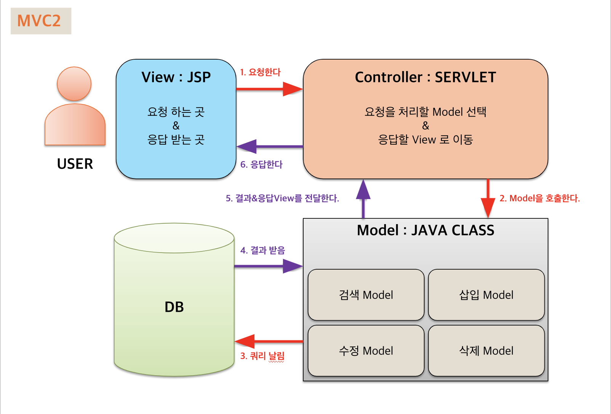

## MyBatis와 MVC 패턴으로 로그인 페이지를 구현해보자

- ### MyBatis란 ?

  - __객체 지향 언어인 자바의 관계형 데이터 베이스 프로그래밍을 보다 쉽게 도와주는 프레임 워크__
  - __자바에서는 관계형 데이터베이스 프로그래밍을 하기위해 JDBC를 제공
        ※JDBC(Java Database Connectivity) : 자바 프로그램이 데이터베이스와 연결되어 데이터를 주고 받을 수 있게 해주는 프로그래밍 인터페이스이다(DriverClass, Connection, PreparedStatement, ResultSet etc)__
  - __MyBatis는 JDBC를 보다 편하게 사용하기 위해 개발되었다.__

- ### MVC 패턴이란?

  - __MVC 는 Model, View, Controller의 약자 입니다. 하나의 애플리케이션, 프로젝트를 구성할 때 그 구성요소를 세가지의 역할로 구분한 패턴입니다.__
  

---

### 사용환경 구축

#### __jar 준비__

- mybatis.jar
- ojdbc6.jar
- taglib.jar
  - taglib-standard-impl.jar
  - taglib-standard-jstlel.jar
  - taglib-standard-spec.jar
- json-simple.jar

#### MyBatis

> mybatis를 사용하기 위한 설정
> DBService.java 객체 생성
> sqlmap-config.xml, member.xml 설정

- sqlmpa-config.xml

```java

```
##### 

---

### MVC 패턴 구축

#### controller

```java

```